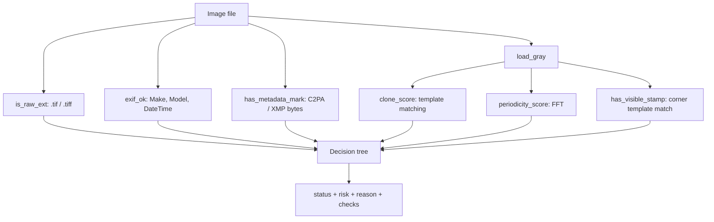

# Architecture

BioProof is a first-pass screen for western blot and gel images. It runs locally, reads one image at a time, and returns a status (Pass, Needs review, Policy issue), a 0 to 100 risk score, a plain-English reason, and the raw check values for an audit trail.

## Flow



## Modules

| File | Responsibility |
| --- | --- |
| `bioproof/io_utils.py` | Loading images as grayscale, raw-format check, EXIF check |
| `bioproof/analyzer.py` | The four detection signals and the decision tree |
| `bioproof/cli.py` | Folder scan that writes a JSON report |
| `app.py` | Streamlit upload interface (1 to 10 images) |
| `tools/` | Scripts that generate the demo images and the watermark stamp |
| `benchmarks/bench_analyzer.py` | Generates labeled synthetic gels and measures detection and latency |

## Detection signals

**Device provenance.** A `.tif`/`.tiff` file or camera EXIF tags (Make, Model, DateTime) counts as evidence the image came from lab equipment. Missing both adds 40 risk points.

**Watermarks.** Two routes: provenance bytes (`c2pa`, `xmpmeta`, `contentcredentials`, `aiprovenance`) in the first 256 KB, or the visible stamp template-matched in the top corners at correlation above 0.85.

**Duplication (`clone_score`).** The image is downscaled to 512 px, normalized, and 12 random 64x32 patches are template-matched against the rest of the image with their own neighborhood masked out. The best match is the score. Above 0.97 adds 40 risk points.

**Periodicity (`periodicity_score`).** Compares the mean log-magnitude of the whole FFT spectrum against a 40x40 window around the center. Above 0.25 adds 35 risk points.

## Decision tree

1. Declared digitally generated and a watermark is present: **Pass**, risk 10.
2. Declared digitally generated with no watermark: **Policy issue**, risk 100.
3. Otherwise risk accumulates from the signals above. Risk of 25 or less with device metadata is a **Pass**. Suspicious signals without device metadata, or no device metadata at all, is a **Policy issue**. Suspicious signals with device metadata go to **Needs review** for a human.

## Benchmark results

`python benchmarks/bench_analyzer.py --n 30` on generated gels (30 per group):

| Measure | Result |
| --- | --- |
| Mean latency per image (800x400) | about 48 ms |
| Visible stamp recall | 30/30 |
| Stamp false positives on clean gels | 0/30 |
| Mean clone score, clean gels | 0.979 |
| Mean clone score, gels with a pasted lane | 0.978 |

## Known gaps

The benchmark and tests surfaced two real limits, left visible on purpose:

- **Duplication does not separate cloned gels from clean ones yet.** Gel bands look alike, so clean gels already score about 0.98, and 12 random patches rarely land on the pasted lane. Better options: dense patch matching over band regions only, or keypoint matching (ORB) with geometric consistency.
- **Periodicity does not react to periodic texture laid over a gel.** The score measures how flat the spectrum is, so white noise scores near 0 and gels score around -2.4 whether or not a grid is added. Detecting isolated off-center spectral peaks would target synthetic textures directly. `tests/test_scores.py` tracks this with a strict expected-failure test that will flag when it gets fixed.

A bug was also fixed while adding tests: the default stamp path pointed at `assets/digital_stamp.png`, which is not in the repo, so visible-stamp detection was silently off in the web app and CLI. The analyzer now finds the bundled stamp.

## Testing

```bash
cd bioproof
pip install -r requirements-dev.txt
pytest -q
```

GitHub Actions runs lint, the test suite, and the benchmark on every push and pull request.
